class: center, middle

# Part 1 - Modeling Sales Data


---

class: center, middle

# Slides: [isaacfab.github.io](https://isaacfab.github.io)


---

# Part 1 Task Overview

.pull-left[

.font120[

* Data Cleaning and Exploring

* Holiday Effects

* Supply and Demand Effects

* Sales Prediction Modeling

* Recommended Actions

]
]
.pull-right[.center[]]

---

# The Data

3 Datasets are used for this analysis. They have various amounts of complexity and preparation.

1 Sales Data
  * **~400k** observations 
  * split between train and test (300k and ~100k obs respectively)
  * weekly data ranging from `2010-02-05` to `2012-10-26`
  * columns include **Store, Dept, Date, Weekly Sales, and Inventory**
  * no missing or obviously corrupted data

2 Stores
  * **45** observations 
  * columns include **Store, type, and size**
  * no missing or obviously corrupted data
  
---

# The Data

3 Datasets are used for this analysis. They have various amounts of complexity and preparation.

3 Features
  * **8190** observations 
  * weekly data ranging from `2010-02-05` to `2013-07-26` 
  * columns include **Store, Date, Temperature, Fuel Price, CPI, Unemployment, Holiday**
  * Data also includes information on various promotions during holidays
  * **This data is quite messy**

---

# Feature Data

.pull-left[
This dataset is quite important as it provides relevant information to weekly sales.

* **Missing Data**
  * CPI and Unemployment are missing **585** observations
  * Promo 1 missing **4158**
  * Promo 2 missing **5269**
  * Promo 3 missing **4577**
  * Promo 4 missing **4726**
  * Promo 5 missing **4140**
]


.pull-right[
.center[
]]

---

# Feature Data

With CPI and Unemployment missing data I used the suggestion to get **external data**. 

After cross checking there are small discrepancies with official government figures and those provided for the case study. 

For example, on just the date `2010-02-05` case study provided CPI was recorded in ranges from **126** and **214** (with a std dev of ~38) When the government reported value was **220**<sup>1</sup>

To avoid ambiguity, I have chosen to replace both missing and provided data with official government data<sup>2</sup>.

.footnote[
[1] [Consumer Price Index - All Urban Consumers](http://www.sca.isr.umich.edu/)

[2] [Unemployment from BLS](https://www.bls.gov/charts/employment-situation/civilian-unemployment-rate.htm)
]

---

# Feature Data

The case of missing data with *Promos* is tricky because the only data available is in the **future** relative to what we want to predict. 

There are a number of ways to fill in (or ignore) missing data called **back casting**: 
 
* Backward Fill 
* Extrapolation
* Seasonal Decomposition

It is important to take data produced by this approach with a grain of salt. 

However, in this case **seasonal decomposition** is the best approach based on the consistent nature of sales cycles.

---

# Feature Data

Back Casting Promo Values

.pull-left[.center[ Okay Model
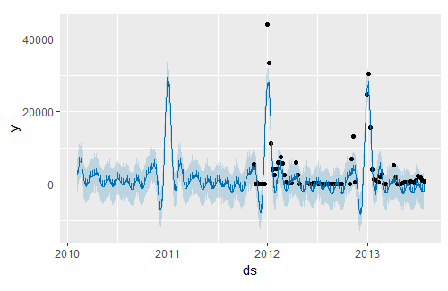
]]

.pull-right[.center[ Noisy Model
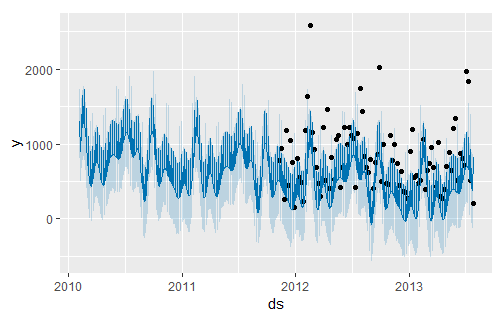
]]

* Model RMSE: **4791** is pulled up by several large outliers 
* Back casting seems to reasonably capture seasonality

---

# Feature Data

In addition to CPI and Unemployment data I have added the following **external data**

* Consumer Sentiment Index
* S&P 500 market price
* VIX - volatility index
* Unemployment by age and race

---

# Sales Data

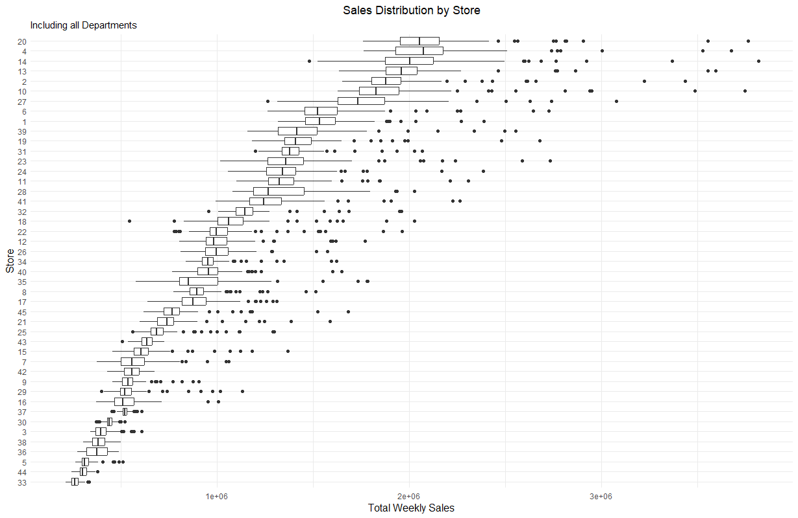

---

# Sales Data

.center[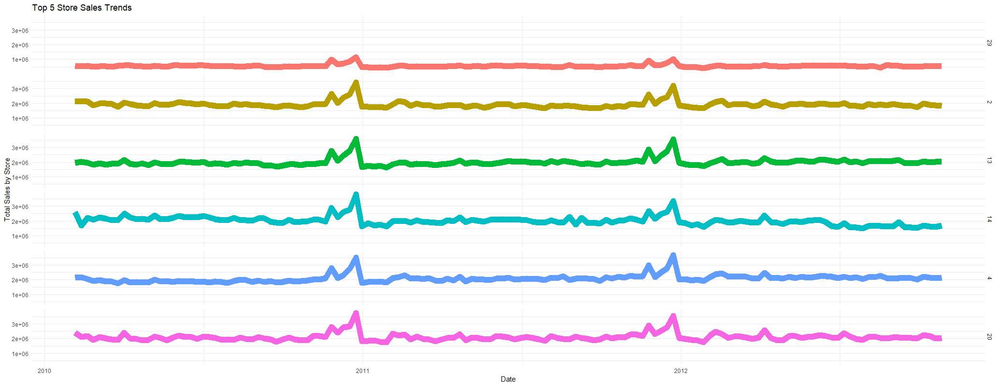]

---

# Sales Data

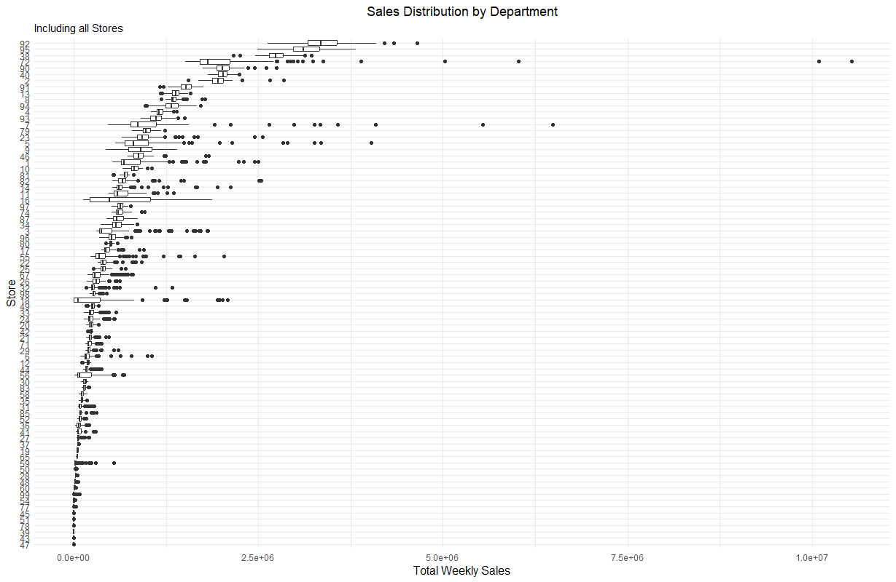

---

# Sales Data

.center[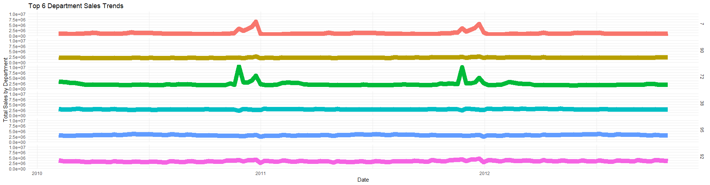]

---

# Holiday Effects

While the total holiday effect is clear from the previous graphs we can also model it quantitatively. The following statistical results are the product of **multiple linear regression:**

.center[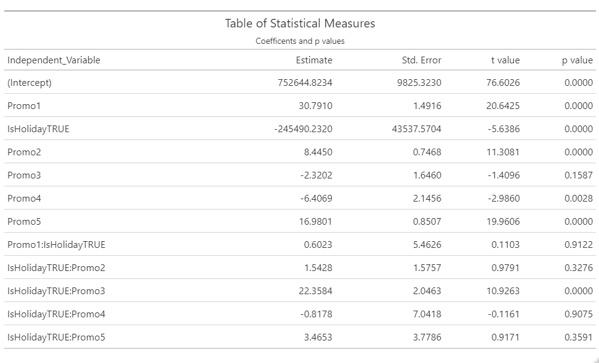]

The p values < .05 are of interest and indicate the present of an effect.

---

#Holdiay Effects

.center[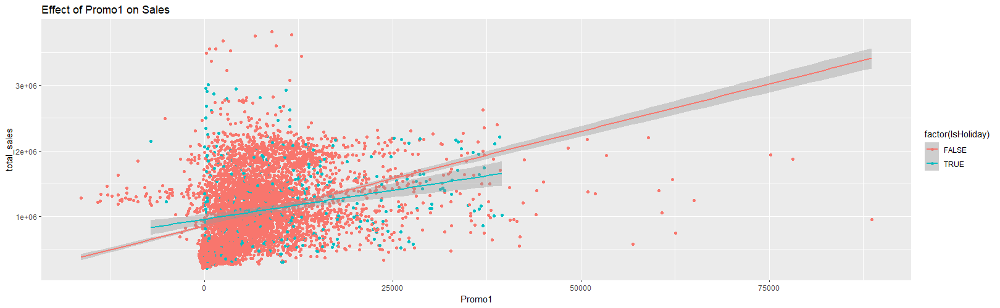]

---

# Supply and Demand Effects

Similar to the Holiday anlsysis Supply and Demand are explored via the following statistical test using **multiple linear regression:**

.center[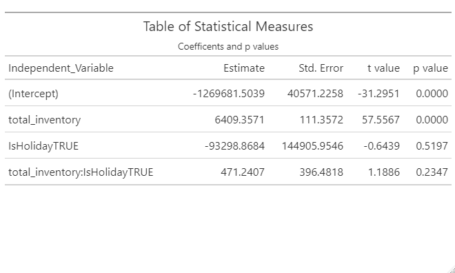]

The p values < .05 are of interest and indicate the present of an effect.

---

# Supply and Demand Effects

.center[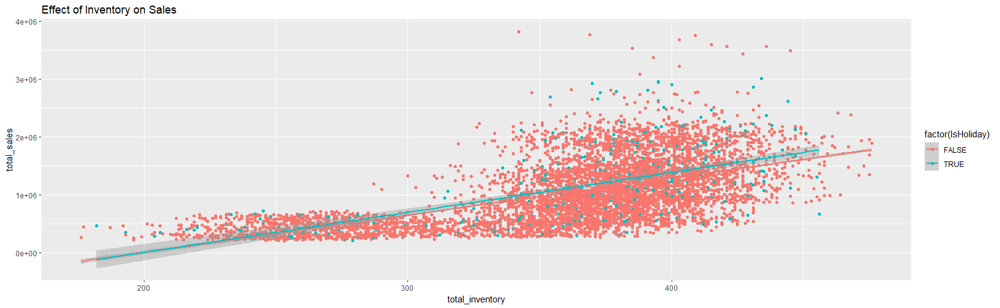]

---

class: center, middle

# Sales Prediction Modeling

---

# Sales Predictions

There are a few important considerations for this approach to modeling:

.pull-left[

* Using a weighted root mean squared error (RMSE) for evaluation
* A number of ML prediction algorithms will be explored
* Will be predicting **rates of change** and not actual sales
]


.pull-right[

.center[]

]

---

# Sales Predictions

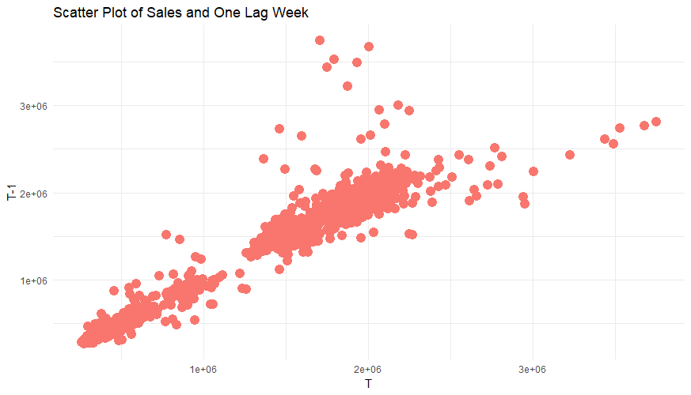

One week to the next, Sales by Store have a correlation of: **0.96**


---

# Benchmarking

Using the same technique as we did for replacing missing data a benchmark can be created;

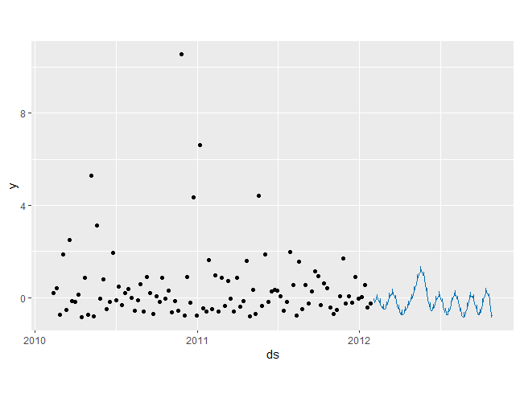

With a standard Seasonal Decomposition model we get a RMSE: **5714** and a WRMSE of **5497**. For context, the Standard Deviation of Weekly Sales is ~22,000.

---

# Machine Learning Approach

To explore many different types of models the data needs to be prepared to avoid **leakage.** Some considerations are:

.pull-left[
* Only use data you 'know' when making a prediction - no time-of or future data
* Manage the lag variables to capture enough but not too much data **(T-x)**
* Based on the nature of this problem explore the following algorithms: **random forest, k-nearest neighbors, boosted trees**
* Use weighted RMSE based on holiday's for error
]


.pull-right[
.center[]
]


```{python eval=FALSE}
def wmae(y_true, y_pred, holiday):
    weights = np.where(holiday, 5, 1)
    return np.sum(weights * np.abs(y_true - y_pred)) / np.sum(weights)
```

---

# Machine Learning Features

.pull-left[
Revisiting the features now that everything is consolidated


* Categorical Features: **Store, Dept, Type, day, week, month, holiday**
* Numerical Features: **return lag, inventory, size, temperature, fuel price, CPI, Consumer Sentiment, VIX, AAPL, S&P500, Unemployment (7 subsets)**


ML models often perform better when variables are **normalized**, which I did using a distribution (*Z-Value*) approach. Categorical features are **encoded** using dummy variables (one hot encoding).]

.pull-right[
.center[]
]

---

# Machine Learning Performance

The performance of the best type of three algorithms after *feature engineering* and *hyper parameter exploration.*

.center[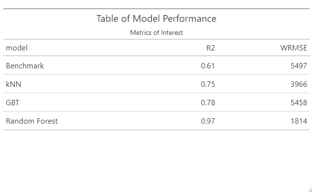]

Over 40 different ML model variations where tested.

---

# Machine Learning Performance

The performance of the best type of three algorithms after *feature engineering* and *hyper parameter exploration.*

.center[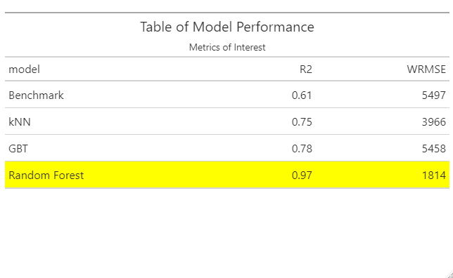]

Over 40 different ML model variations where tested.

---

# kNN Model Performance

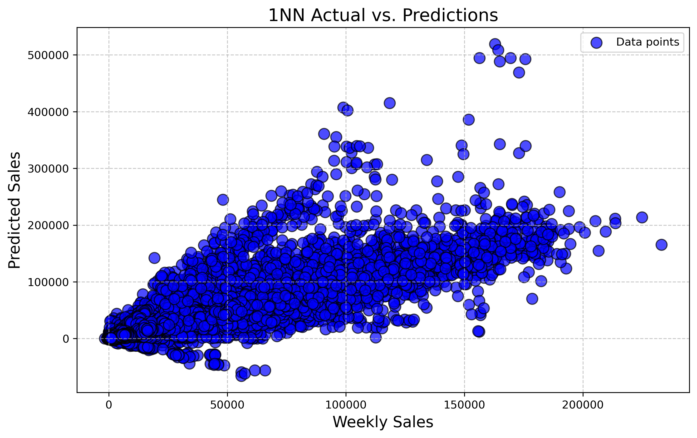

---

# Tree Model Performance

.pull-left[
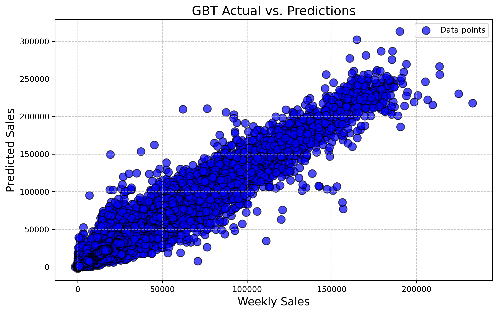

]

.pull-right[
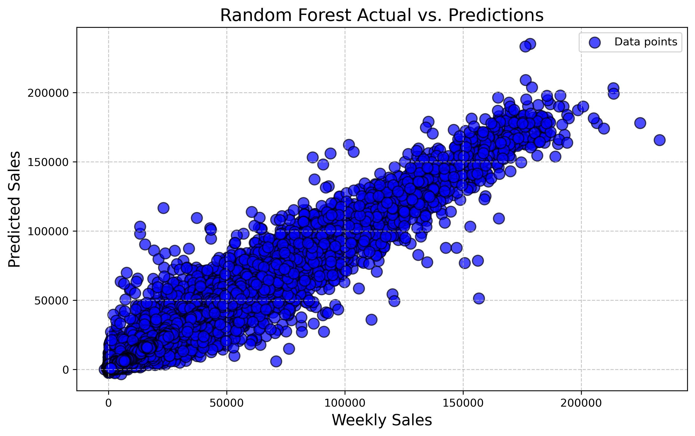

]

---

# Feature Importance

.center[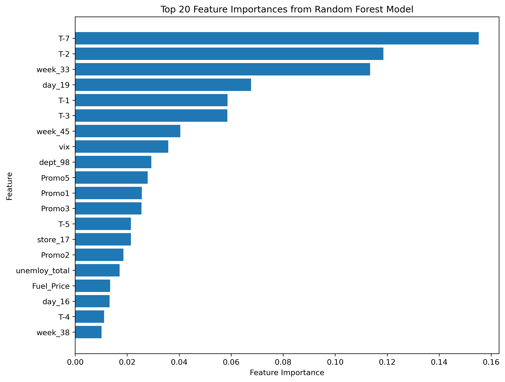]

---

# Recommendations

## 1. Explore,via experimentation, the trade-off between promotions and sales on non-holidays
## 2. Holiday's provide their own demand so prioritizing inventory is best
## 3. Sales modeling should be done via a set of smaller models that aggregate - incorporate more heuristics into modeling

---

class: center, middle

# Part 2 - Research Plan: Bike+

---

# Research Plan Overview


.pull-left[

* The goal of this project is better understand demand to create **business value**
* Specifically looking at new products and how **Demand Generating (DG) events**, like launches, impact demand
* The Research Plan is above all be about **rapid experimentation and testing**
]

.pull-right[


]

---

# The Research Pardigm

.center[]


---

# Common Tools and Team

.center[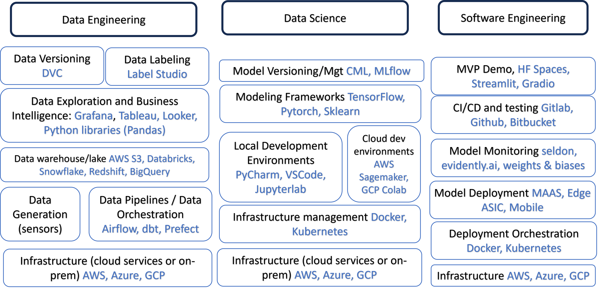]

Settle quickly on a *common but flexible* technology stack that enables collaboration and rapid experimentation

---

# Data Engineering


Need a robust collection of all relevant data. Made available for exploration and production purposes.

.pull-left[

#### Internal Data
* Sales Hisotry
* Customer Demographics
* Past DG events
* Telemetry 
* Relevant video/audio

#### External Data
* Market Trends
* Macro Economic Factors
* Social Media Activity
* Competitors Relevant Activity

]

.pull-right[


]

---

# Date Science

Need a common collaborative data science environment for a team to decompose problems.

.pull-left[

#### Methodologies
* Exploratory Data Analysis 
* Feature Engineering
* Model Selection
* Testing and Validation 

#### Specific Focuses
* Robust statistical hypothesis testing for DG impact
* Running a set of Naive models for benchmarks
* Predicting Demand using a suite of supervised ML algorithms
* Recommend DG focus points, promotions, and inventory levels

]

.pull-right[


]

---

# Date Science - Test and Evaluation

The standard for how algorithms should be evaluated will drive rapid iteration and quality.

.pull-left[

#### Methodology
* Use techniques from **Decision Analysis (DA)** for modeling choices and uncertainties (like how much inventory per store)
* ML models will be designed around the uncertainly in these DA models and prioritized based on the **Value of Data**
* The primary metric of concern will be maximizing **risk adjusted expected business value**
* Any technique to improve this metric is acceptable


]

.pull-right[


]

---

# Software Engineering

.pull-left[

#### Sharing Insights
* Have a approaches to share research outcomes via UI or API
* Presentation approaches should be scaleable as needed but not at the expense of experimentation
* Should be easily tied into other organizational software engineering efforts
]

.pull-right[


]


---

# Conclusion & Recommendations

### 1. Create the infrastructure for rapid experimentation and deployment.

### 2. Develop and approve testing and evaluation metrics starting with risk adjusted business value (from a DA model).

### 3. Make experimentation results easily consumable by the rest of the organization.

